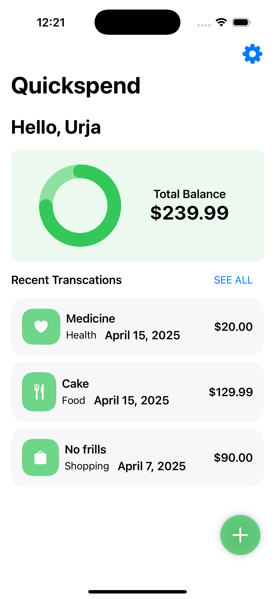
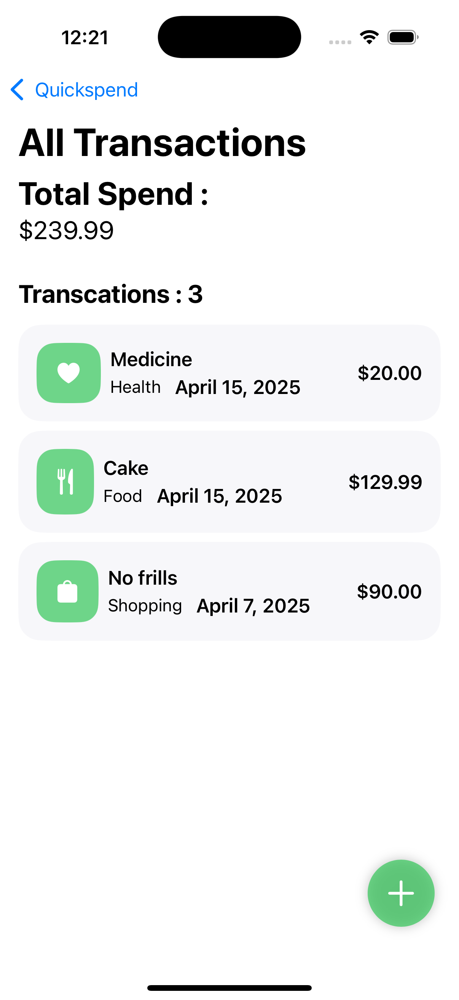
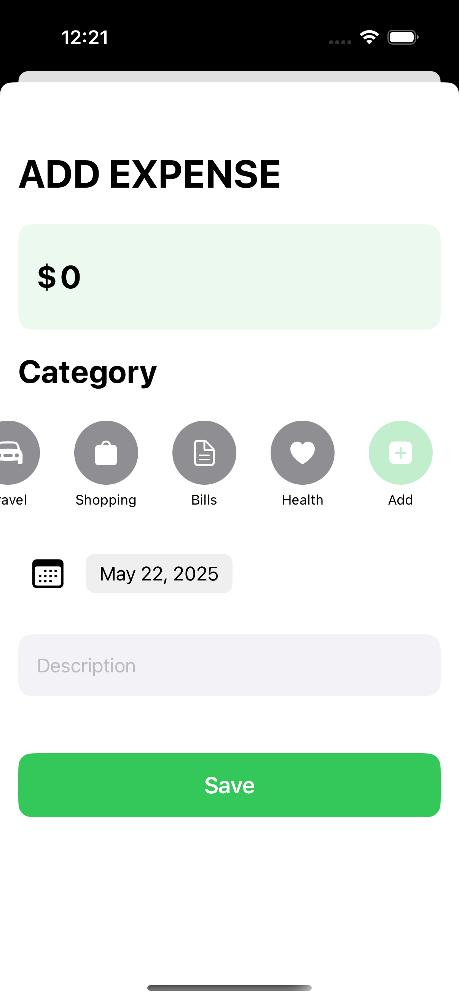
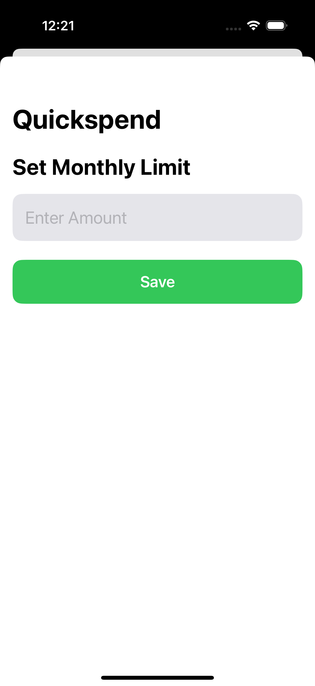
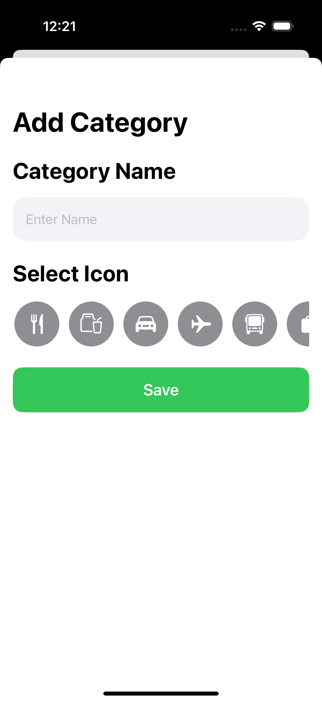

# 💸 Quickspend – Minimal iOS Expense Tracker

Quickspend is a lightweight and beautifully designed iOS app that helps users stay on top of their spending. It allows you to track expenses, view transaction history, set monthly spending limits, and even create your own categories — all without clutter or complexity.

---

## ✨ Features

- ✅ **Dashboard overview** with a circular progress chart for total balance
- 💵 **Log new expenses** with category, amount, date, and description
- 📂 **View all transactions** with breakdown by category and date
- 🧩 **Create your own categories** with custom icons
- 🎯 **Set a monthly limit** to stay within budget
- 🌓 **Dark mode** support for seamless UI
- 🧠 Simple, user-friendly design — no sign-up required

---

## 📸 Screenshots

### 📊 Dashboard Overview


### 📃 View All Transactions


### ➕ Add New Expense


### 🎯 Set Monthly Limit


### 🧩 Create Custom Category


---

## 📦 Getting Started

To run Quickspend locally on your machine:

1. **Clone the repository**
   ```bash
   git clone https://github.com/yourusername/Quickspend.git

2. Open Xcode
  cd Quickspend
  open Quickspend.xcodeproj

3. Build and Run
  - Use iPhone Simulator (iOS 16+)
  -Hit Cmd + R or the ▶️ button in Xcode

🔧 Requires Xcode 15+ and SwiftUI
